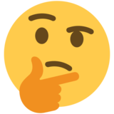

---
title:
- Introduction
subtitle: |
    | (SNLP tutorial)
author:
- Vilém Zouhar
theme:
- Boadilla
date: \today
aspectratio: 169
header-includes:
  - \AtBeginDocument{}
---

# Overview 

\begin{itemize}
\setlength{\itemsep}{-0.2cm}
\item Hello
\item Topics (10 minutes)
\item Requirements (10 minutes)
\item Materials
\item Cheating
\item Homework (10 minutes)
\end{itemize}

# Hello

\centering

\large Who am I? 

. . .

\LARGE Who are you?

{width=25px}

# Topics

Task: Pick one not yet taken + why do you find it interesting.

- Language properties, Zipf's Law
- Entropy, basic information theory (Shannon's game, entropy-based quantities, code lengths)
- Language modelling, back-off models (interpolation, discounting)
- Text classification, basic classification algorithms (kNN, decision trees, SVM, \ldots)
- Word sense disambiguation, dictionary / translation / collocation based disambiguation
- Information retrieval, latent semantic analysis, singular value decomposition
- Machine translation, word alignment, beamsearch
- Sequence labeling (hidden markov chains / models, conditional random fields)

# Requirements

TBD

||Points|Weight|
|:-|:-:|:-:|
|Homework|TBD|$\Rightarrow$ TBD%|
|Final Project|TBD|$\Rightarrow$ TBD%|
|Bonus Points|TBD|$\Rightarrow$ TBD%|
|\midrule Required|TBD|$\Rightarrow$ TBD%|

. . .

## Bonus Points

- Activity during tutorials
- Extraordinarily nice solutions to HW
- Contributing to \textbf{
  \href{https://github.com/zouharvi/uds-snlp-tutorial}{github.com/zouharvi/uds-snlp-tutorial}
}
- Presenting one of the topics (details later)

\note{
Contributing:

\begin{itemize}
\item Semi-non-trivial (more than a single typo correction) PRs to get a bonus point\newline (although PR those as well!)
\item Also aesthetical changes are permitted
\item Any suggestions/activities on the repository are welcome
\item Contact me if you run into technical issues (though just editing the markdown should be enough)
\end{itemize}

HW:

\begin{itemize}
\item Mention if you think you deserve extra points when submitting
\end{itemize}

}

# What's available

- Lectures by prof. Klakow
- Live tutorials
- Tutorial handouts
- Consultations {live, email, chat}
- Corrected homework

# Cheating

. . .

\centering \footnotesize

no

# Homework

TBD

# Resources

1. UdS SNLP Class: <https://teaching.lsv.uni-saarland.de/snlp/>
2. Tutorial repository: <https://github.com/zouharvi/uds-snlp-tutorial>