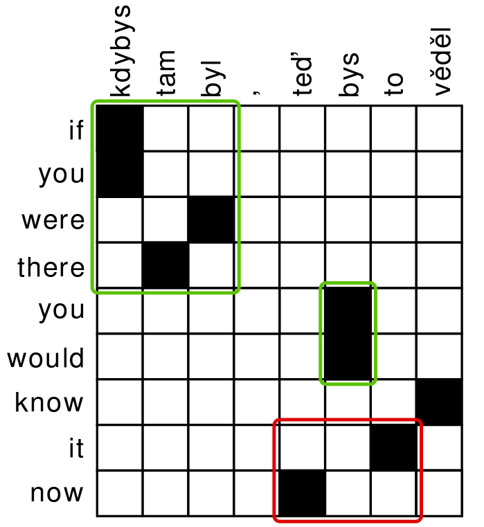
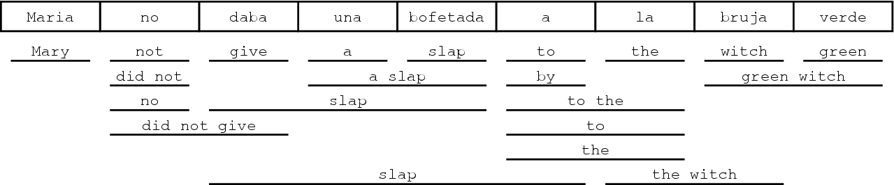

---
title:
- "Statistical Machine Translation"
subtitle:
- \{Phrase-Based,Vanilla Neural\} (SNLP tutorial)
author:
- Vilém Zouhar
theme:
- Boadilla
date:
- February, 2021
aspectratio: 169

documentclass: beamer
classoption: notes
---

# Overview

- Task, metrics
- PBMT
- - Decoding
- - - Proof of NP-hardness
- - - Log-linear model
- - Alignment
- - - IBM1
- - - Phrase extraction
- NMT
- - encoder-decoder
- - embedding 

# Task

> - Given source $s$, output target $t$: $argmax_t \{p(t|s)\}$
> - $= argmax_t\{p(s|t)/p(s)\cdot p(t)\}$
> - $= argmax_t\{p(s|t) \cdot p(t)\}$ 
> - Modelling $p(s|t)$ is as hard/easy as $p(t|s)$ \newline
    Modelling $p(t)$ is easier 

# Approaches
- RBMT (rule-based)
- EBMT (example-based)
- SMT (statistical)
- - PBMT (phrase-based)
- - NMT (neural)

# Metrics - BLEU

\begin{block}{BLEU}
Reference $r$, Candidate $c$

$$ \min(1, exp(1-|r|/|c|)) \times (p_1\cdot p_2\cdot p_3\cdot p_4)^{1/4} $$
\end{block}

- Brevity penalty $\times$ geom. average of precisions
- Score 0-100% (usually without the percentage)

Reference: \qquad\qquad\hspace{0.05cm} What is the purpose of all this ? \newline
Hypothesis: \qquad\qquad  What is the meaning of all this ? \newline
matching 3-grams: \quad (What, is, the), (of, all, this), (all, this, ?) \newline
total 3-grams: \qquad\quad  6 \newline
$\rightarrow$ \newline
$p_3 = 3/6 = 1/2$ \newline
$p_1 = 7/8, p_2 = 5/7, p_4 = 1/5$, BP = $1$, BLEU = $50$. 

# Metrics

- Many more: ChrF, TER, METEOR
- Every MT metrics faces criticism (~90% correlation with humans [5])
- Human judgement **inconsistent**
- SoTA German-English: ~40
- Strongly depends on:
- - Tokenization scheme (+10 BLEU(!))
- - Used corpus
- _Always_ use existing BLEU implementation [6]

# Components of PBMT

- Alignment
- - Extracting phrases
- Decoding
- - Covering the source sentence with extracted phrases
- - Scoring "coverings" using a language model 

# Phrase Extraction

::: columns

:::: column
- Extract all consistent phrases
- _if you were there_
- _if you were there you would know it now_
- _you would_
- _know it_
- _you would know it now_
- _..._
- Extracted phrases have to be "full" - no gaps that are aligned outside of the extraction
- Similar concept to projectivity
::::

:::: column
{height=80%}
Source: [2]
::::

:::

# Decoding

- Cover the source sentence with extracted phrases

{width=100%}
Source: [1]

# Beam search

- Start with 0 coverage and keep track of already covered words
- Estimate the cost of the existing phrases (language model) (+ future cost)

{width=80%}
Source: [1]

# Beam search - NP-complete

1. Consider travelling salesman / hamilton circuit
2. $LM(x,y) = -\log dist(x, y)$
3. $LM$ prohibits repetitions\newline
   $LM$ adds the distance between the first and the last word
4. Source sentence: `NULL-NULL-NULL-NULL-...` \newline
   `NULL` can be covered by any city/node
5. Beam search finds the most probable / cheapest ordering:\newline
   `NewYork-Boston-Trenton-...`

<br>

- MT beam search solves the traveling salesman problem $\rightarrow$ vanilla beam search is NP-hard.
- Future cost estimation is used + top N hypothesis paths considered (rest pruned).
- Much faster, but no optimal solution guarantee.

# PBMT Log-linear Model

- Not statistically sound, but:
- $t = argmax_t\{p(s|t) \cdot p(t)^2\}$ for more fluent output
- $t = argmax_t\{p(t|s) \cdot p(t)^2\}$ works equally well

Log-linear model:

> - $t = argmax_t\ exp(\sum_{\text{feature } f} \lambda_f f(e, t))$
> - Adequacy: $f_{TM}(e,t) = \log p(t|s)$\
> - Language model: $f_{LM}(e,t) = \log p(t)$\
> - $f_{Phr}(e,t) = \textit{number of covering phrases}, \lambda_{Phr} = -1 \textit{ (e.g.)}$\
> - - Perhaps we want larger phrases to cover the source sentence

# Alignment

> - Soft alignment: values in the interval $[0,1]$ instead of hard decisions $\{0,1\}$

> - Given an alignment (A), can we construct word translation probabilities (T)?
> - Yes: $T(x|y) = \frac{\sum_{\text{sents } s, t} A_{s,t}(x|y)}{T(\cdot|y)}$
> - Given word translation probabilities (T), can we construct word alignment (A)? 
> - Yes: $A_{s,t}(x|y) = \frac{T(x|y)}{\sum_{u \in s} T(u|y)}$
> - If we start from $A^1$, then compute $T^1$ and then $A^2$, will $A^1 = A^2$?
> - No, in most cases.
> - Main idea behind IBM Model 1: change "views" e.g. 5 times.
> - Start with $A^0_{s,t}(x|y) = \frac{1}{|s|}$ (uniform distribution)

# IBM Model 1 Code

```
# expectation
words_prob = np.zeros((len(words2), len(words1)))
for (sent_src, sent_tgt), probs in zip(sents, alignment_probs):
    for word_tgt, probline in zip(sent_tgt, probs):
        for word_src, prob in zip(sent_src, probline):
            words_prob[word_tgt][word_src] += prob
# normalize rows
words_prob = (words_prob.T / np.sum(words_prob, axis=1)).T

# maximization
for sent_i, (sent_src, sent_tgt) in enumerate(sents):
    for pos_src, word_src in enumerate(sent_src):
        for pos_tgt, word_tgt in enumerate(sent_tgt):
            probs[pos_tgt][pos_src] = words_prob[word_tgt][word_src]
    # normalize sentence columns
    alignment_probs[sent_i] = probs / np.sum(probs, axis=0)
```

# IBM Model 1 - Hard alignment

- At the end, take $H_{s,t}(y) = argmax_{x} (A_{s,t}(x|y))$ 
- Assumption: every target token is aligned to exactly one source token
- What about alignment between a Slavic language without articles and a Germanic one, with articles?
- - Czech-German [3]: 24% target tokens unaligned
- - Czech-German [3]: 1.1 aligned tokens per one target token (excluding unaligned)

- Solution:
- - Add NULL token to every sentence, then remove alignments to it in post-processing
- - Use a different extraction method than argmax (threshold, dynamic threshold, ..)

# NMT - Training

- Traditional NMT pipeline too big + lots of preprocessing
- End-to-end training

1. Embedd words in one-hot embedding:
```
        dog       = (1, 0, 0, 0, ...)
        cat       = (0, 1, 0, 0, ...)
        broccoli  = (0, 0, 1, 0, ...)
        broccolis = (0, 0, 0, 1, ...)
```
2. Feed the whole sentence sequentially into an RNN (vanilla, LSTM, GRU)
3. Get a hidden state representing the whole sentence
4. The output of this last step is the first translate word (distribution) \newline
    We know the correct word, start accumulating gradient
5. Push the output word into the hidden state, get next word
6. Repeat 4.+5. util `<EOS>` on the training sentence

# NMT - Translation

- Traditional NMT pipeline too big + lots of preprocessing
- End-to-end training

1. Embedd words in one-hot embedding
2. Feed the whole sentence sequentially into an RNN (vanilla, LSTM, GRU)
3. Get a hidden state representing the whole sentence
4. The output of this last step is the first translate word (distribution)
5. Push this word into the hidden state, get next word
6. Repeat 4.+5. util `<EOS>`

In 4. apply beam search or (since we have the probabilities) just take the max.

# NMT - Issues

> - Issue: The end of the sentence is represented best in the single hidden state
> - Lots of crucial information is at the beginning of the sentence \newline
    People judge the beginning much more than the rest
> - Solution: Feed in the sentence reverse
> - Solution: BiRNN
> - Solution: Explicit attention

> - Issue: Whole sentence meaning captured by a single vector
> - Solution: Explicit attention mechanism (also alleviates vanishing gradients) \newline
    Transformer architecture (encoder can also be parallelized)

> - Issue: |broccoli-broccolis|$_2^2$ = |broccoli-dog|$_2^2$
> - Solution: learn word embeddings from monolingual data \newline
    (word2vec: CBOW/skip-gram, Glove)
> - Also allows for basic arithmetics: king - man + woman = queen

# Tools

- Alignment:
- - fast\_align (easy to setup+run, fast, adjusted IBM2) [8]
- - (M)GIZA++ (more advanced, slightly better results) [9]
- PBMT:
- - Moses MT [10]
- NMT:
- - Marian NMT (fast, used by most in WMT, maintained, a bit harder to debug - C++) [11]
- - Huggingface's transformer (harder to setup, easy Python interop) [12]

# References

1.  PBMT pipeline: <http://www.statmt.org/moses/?n=Moses.Background>
2.  Phrase extraction: <https://nlp.fi.muni.cz/en/MachineTranslation>
3.  Aligned CSEN corpus: <http://ufal.mff.cuni.cz/czech-english-manual-word-alignment>
4.  Capacity of a single $&!#* vector: <https://www.aclweb.org/anthology/P18-1198.pdf>
5.  BLEU-human annotation correlation: <https://www.aclweb.org/anthology/2020.wmt-1.41.pdf>
6.  Go-to BLEU implementation: <https://github.com/mjpost/sacreBLEU>
7.  SMT course: <http://ufal.mff.cuni.cz/courses/npfl087>
8.  fast_align: <https://github.com/clab/fast_align>
9.  GIZA++: <http://www.statmt.org/moses/giza/GIZA++.html>
10. Moses MT: <http://www.statmt.org/moses/>
11. Marian NMT: <https://marian-nmt.github.io/>
12. Transformers: <https://huggingface.co/transformers/usage.html>