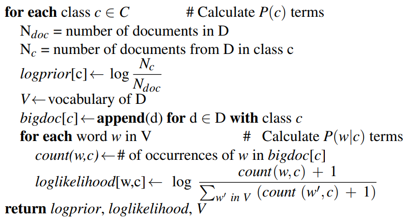
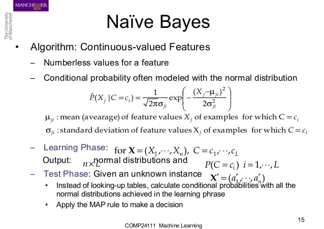

---
title:
- QA Session
subtitle: |
    | (SNLP tutorial)
author:
- Vilém Zouhar
theme:
- Boadilla
date: 21st July 2021
aspectratio: 169
header-includes:
  - \AtBeginDocument{}
---

# Perplexity 

> - How can we define it?
> - Suppose that we generate a random sequence of digits S in the decimal system, where each digit in S is drawn from a uniform distribution.  What is the perplexity of S in the following cases:
> - - S is a sequence of length 5
> - - S is a sequence of length 25

<!-- cross-entropy between observed distribution and predicted one, results in 10 in either case -->

# Word Sense Disambiguation

> - Formal definition of the problem
> - Naive Bayes for WSD
> - Flip-Flop for clustering (???)

# Conditional Random Fields

> - First and second-order HMM
> - Suppose you have a sequence of length M and tagset of size T, what would be the complexity of the normalization factor Z(x) in this case?
> - Bayesian network, cliques

# Naive Bayes

> - Naive Bayes pseudocode
> - Suppose you have a Naive Bayes classifier for topic categorization that is defined over a vocabulary of size V and a category label set of size C. How many parameters does this model have?
> - Exercise 12 from 2020 exam

# Naive Bayes - Code

\centering

{ width=450px }

# Naive Bayes - Code

\centering

{ width=450px }

# Significance Testing

- How to use Chi-Square?

# Compression

- Kraft's inequality and trees
- Optimal code length: $-\log_D p(w_i)$
- Encoding using a tree

# Vector-Space Model

- Representation
- Retrieval (scoring vs bayes) + decision rule
- Classification

<!-- Generative vs discriminative model-->

# Jensen's Inequality

> - For convex functions, opposite holds for concave ones
> - Such as: $x^2$, $\log$
> - $WA(f(x_i)) \ge f(WA(x_i))$  

# Resources

- <https://miro.medium.com/max/1400/1*neaBooRXSloZAz6A2XfHJA.png>
- <https://image.slidesharecdn.com/naive-bayes-150514165844-lva1-app6891/95/naive-bayes-15-638.jpg?cb=1431622795>
