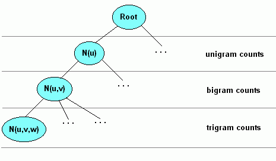

---
title:
- Assignment 4,5 + Smoothing 1
subtitle: |
    | (SNLP Tutorial 5)
author:
- Vilém Zouhar, Awantee Deshpande, Julius Steuer
theme:
- Boadilla
date: 25th, 27th May 2021
aspectratio: 169
header-includes:
  - \AtBeginDocument{\usepackage{graphicx}}

documentclass: beamer
# classoption: notes
---

# Assignment 4

- Exercise 1: Huffman encoding 
- Exercise 2: Conditional entropy of DNA
- Bonus: Huffman encoding adaptations

# OOV words

::: frame
## Corpus
* Train set: 

\qquad {width=15px}
{width=15px}
{width=15px}
{width=15px}
{width=15px}
{width=15px}
{width=15px}
{width=15px}
{width=15px}
{width=15px}
{width=15px}
{width=15px}
{width=15px}
{width=15px}
{width=15px}
{width=15px}

* Test set:

\qquad {width=15px}
{width=15px}
{width=15px}
{width=15px}
{width=15px}
{width=15px}
{width=15px}
{width=15px}
{width=15px}
{width=15px}
{width=15px}
{width=15px}

:::

. . .

::: frame
## Accumulate counts

* 
{width=15px} `6` \qquad
{width=15px} `5`  \qquad
{width=15px} `3` \qquad
{width=15px} `2` \qquad

* 
{width=15px} `4` \qquad
{width=15px} `2`  \qquad
{width=15px} `2` \qquad
{width=15px} `2` \qquad
{width=15px} `1` \qquad
{width=15px} `1` \qquad
:::

. . .

::: columns
:::: column
## OOV words
> * What about {width=15px} and {width=15px}?
> * OOV rate?
> * $3/12 = 25\%$
> * Solutions?
::::

. . .

:::: column
## OOV words
> * How do we even know this will be an issue?
::::
:::

 <!-- character-level, subword units -->

# Subword Units

Solution to OOV words: go lower

> - Characters: $V = \{a,b,c,\ldots, \_\}$
> - Syllables: $V = \{bo,ve,r,how, \ldots, \_\}$
> - Data-driven units (subwords): $V = \{smi,les,es,clo, \ldots, \_\}$
- - Byte Pair Encoding, Word Piece, Sentence Piece
- - Start with the alphabet, merge and add frequent character-level n-grams
- - E.g. `bedclothes became white` $\rightarrow$ `bed @cloth @es be @came @white`
- - Used heavily in any modern NLP (MT, LM, QA, $\ldots$)

## Questions
> - Can we still get an unknown "word"? <!-- Yes, unknown character not part of the original alphabet -->
> - How do we define perplexity for subword language models? <!-- We use the same splitting on the test corpus -->

# Smoothing

- Words present in vocabulary, but have ~0 probabilities
- Words present in vocabulary, but have unseen context

Solution: Assign probability mass from frequent events to infrequent events (Smoothing/Discounting)

\centering

{width=200px}

- Will cover different smoothing methods over the next few tutorials

# Additive smoothing (add-$\alpha$-smoothing)

:::frame
## Distribution
* Add zero counts to frequency table

{width=15px} `6` \qquad
{width=15px} `5`  \qquad
{width=15px} `3` \qquad
{width=15px} `2` \qquad
{width=15px} `0` \qquad
{width=15px} `0` \qquad

* Increase all counts by $\alpha = 1$

{width=15px} `6+1` \qquad
{width=15px} `5+1`  \qquad
{width=15px} `3+1` \qquad
{width=15px} `2+1` \qquad
{width=15px} `0+1` \qquad
{width=15px} `0+1` \qquad

* Divide by $N = 22$

{width=15px} `0.32` \qquad
{width=15px} `0.27`  \qquad
{width=15px} `0.18` \qquad
{width=15px} `0.13` \qquad
{width=15px} `0.05` \qquad
{width=15px} `0.05` \qquad
:::

:::frame
## Perplexity
* Relative frequencies on test corpus:

{width=15px} `0.33` \qquad
{width=15px} `0.17`  \qquad
{width=15px} `0.17` \qquad
{width=15px} `0.17` \qquad
{width=15px} `0.08` \qquad
{width=15px} `0.08` \qquad

. . .

* PP = $2^{(0.33 \cdot 0.32 + 0.27 \cdot 0.17 + 0.18 \cdot 0.17 + 0.13 \cdot 0.17 + 2 \cdot (0.05 \cdot 0.08))} = 1.4$
* What would be PP with unsmoothed model?
:::

# Additive smoothing: Bigrams

Recall the additive smoothing formula for unigrams:

\begin{equation}
C^*(w_i) = C(w_i) + \alpha
\end{equation}
\begin{equation}
N^* = \sum_{w_i \in V} C^*(w_i) = N + \alpha |V|
\end{equation}

. . .

\begin{equation}
p^*(w_i)
= \frac{
  C(w_i) + \alpha
}{
  N^*
}
= \frac{
  C(w_i) + \alpha
}{
  N + \alpha|V|
}
\end{equation}

. . .

<!-- * What is $N$? What is $V$? -->
<!-- Remember from Assignment 2 that: -->

\begin{equation}
p(w_i|w_{i-1}) = \frac{C(w_{i-1},w_i)}{C(w_{i-1})}
\end{equation}

. . .

Smoothen the bigram count: $C(w_{i-1},w_i) \rightarrow C(w_{i-1}, w_i) + \alpha$
<!-- * Normalization: $p_{smoothed}(w_i|w_{i-1}) = \frac{C(w_{i-1},w_i) + \alpha}{\text{\large ?}}$ -->

# Additive smoothing: Bigrams

::: frame
## Corpus 
{width=15px}
{width=15px}
{width=15px}
{width=15px}
{width=15px}
{width=15px}
{width=15px}
{width=15px}
{width=15px}
{width=15px}
{width=15px}
{width=15px}
{width=15px}
{width=15px}
{width=15px}
{width=15px}

Bigrams:
{width=15px}{width=15px}, {width=15px}{width=15px}, {width=15px}{width=15px}, {width=15px}{width=15px}, ..., {width=15px}{width=15px}, {width=15px}{width=15px} $\leftarrow$ circular bigram!

Bigrams: AA, AA, AE, EA, ..., AE, EA
:::

# Additive smoothing: Bigrams: bigram counts

* Collect bigram counts & condtional probabilities for history $A$

| Bigram | $C(A, w_i)$ | $C(A)$| $\frac{C(A,w_i)}{CA)}$ |
| ------ | :-----: | :-----: | :---: |
| AE     | 3       | 6       | 1/2   |
| AA     | 2       | 6       | 1/3   |
| AB     | 1       | 6       | 1/6   |

# Additive smoothing: Bigrams: add alpha

* We encounter an unknown bigram $AF$

| Bigram | $C_{\alpha}(A,w_i)$ | $C(A)$| $\frac{C_{\alpha}(A,w_i)}{C(A)}$ |
| ------ | :-----: | :-----: | :---: |
| AE     | 3+1       | 6      | 4/6  |
| AA     | 2+1       | 6      | 3/6  |
| AB     | 1+1       | 6      | 2/6  |
| $\rightarrow$ AF | 0+1  | 6  | 1/6  |

. . .

> * Not a probabilitiy distribution! 
> * Solution: We need to adjust the divisor a tiny bit. But how tiny?

# Additive smoothing: Bigrams: normalization

* Add $\alpha \cdot 4$ to history count
* Pretend that we have seen the history $|V| = 4$ times more.

. . .

| Bigram | $C{_\alpha}(A) + \alpha |V|$| $\frac{C_{\alpha}(A,w_i)}{C(A) + \alpha |V|}$ |
| ------ | :-----: | :---: |
| AE     | 6 + 4   | 4/10  |
| AA     | 6 + 4   | 3/10  |
| AB     | 6 + 4   | 2/10  |
| $\rightarrow$ AF | 6 + 4 | 1/10 |

. . .

* Now the probabilities sum up to 1: $4/10 + 3/10 + 2/10 + 1/10 = 1$

# Additive smoothing: Bigrams: normalization

* We encounter another n-gram $AD$
* What is $|V|$ now?

. . .

| Bigram | $C{_\alpha}(A) + \alpha |V|$| $\frac{C_{\alpha}(A,w_i)}{C(A) + \alpha |V|}$ |
| ------ | :-----: | :---: |
| AE     | 6 + 5   | 4/11  |
| AA     | 6 + 5   | 3/11  |
| AB     | 6 + 5   | 2/11  |
| $\rightarrow$ AF | 6 + 5 | 1/11 |
| $\rightarrow$ AD | 6 + 5 | 1/11 |

. . .

* $C(A)$ is constant, unsmoothed count
* Probabilities sum up to 1: $4/11 + 3/11 + 2/11 + 1/11 + 1/11 = 1$

# Additive smoothing: Bigrams: general case

* General formula for smoothed bigram Probabilities:

\begin{equation}
p(w_i|w_{i-1}) = \frac{C(w_{i-1},w_i) + \alpha}{C(w_{i-1}) + \alpha|V|}
\end{equation}

. . .

* What is $V$?

. . .

* $|V|$ = Number of bigram **types** starting with $w_{i-1}$

. . .

\begin{equation}
p(w_i|w_{i-1}) = \frac{C(w_{i-1},w_i) + \alpha}{C(w_{i-1}) + \alpha|V_{(w_{i-1},\bullet)}|}
\end{equation}

. . .

* For n-grams of length $n$:

\begin{equation}
p(w_i|w_{i-1}:w_{i-n+1} ) = \frac{C(w_{i-n+1}:w_i) + \alpha}{C(w_{i-n+1}:w_{i-1}) + \alpha|V_{(w_{i-n+1}:w_{i-1},\bullet)}|}
\end{equation}

# Additive smoothing: Bigrams: general case

* For n-grams of length $n$:

\begin{equation}
p(w_i|w_{i-1}:w_{i-n+1} ) = \frac{C(w_{i-n+1}:w_i) + \alpha}{C(w_{i-n+1}:w_{i-1}) + \alpha|V_{(w_{i-n+1}:w_{i-1},\bullet)}|}
\end{equation}

* We already know the shared (train + test) vocabulary $V$

. . .

* $V_{(A, \bullet)}$ is then $AA, AB, AC, AD, AE, AF$ $\Rightarrow$ $|V_{(A, \bullet)}| = 6 = |V|$

. . .

* We find that the formula we found is identical to the one on the lecture slides!

\begin{equation}
p(w_i|w_{i-1}:w_{i-n+1} ) = \frac{C(w_{i-n+1}:w_i) + \alpha}{C(w_{i-n+1}:w_{i-1}) + \alpha|V|}
\end{equation}

# Backing-off 

\begin{center}
\textbf{MARY HAD A LITTLE LAMB}
\end{center}

- Consider the bigram (LITTLE MARY)
- Consider the trigram (HAD A LAMB)

For a trigram $p(w_3|w_2, w_1)$, use probability of bigram $P(w_3|w_2)$, else back-off to unigram probability $P(w_3)$.

$$
0.5 \cdot p(w_3|w_2, w_1) + 0.25 \cdot p(w_3|w_2) + 0.25 \cdot p(w_3)
$$
$$
0.5 \cdot p(\text{lamb}|\text{a}, \text{had}) + 0.25 \cdot p(\text{lamb}|\text{a}) + 0.25 \cdot p(\text{lamb})
$$

Will be covered in more detail in further tutorials.

# Count Trees

\centering 

{width=350px}

# Assignment 5

- Exercise 1: OOV Words
- Exercise 2: Additive smoothing
- Exercise 3: Perplexity, infinite smoothing, interpolation
- Bonus: Other language models

# Resources

1. UdS SNLP Class: <https://teaching.lsv.uni-saarland.de/snlp/>
2. Additive smoothing: <https://en.wikipedia.org/wiki/Additive_smoothing>
3. n-gram count trees: <http://ssli.ee.washington.edu/WS07/notes/ngrams.pdf>
4. n-gram models: <https://web.stanford.edu/~jurafsky/slp3/3.pdf>
5. Count-trees figure: <https://www.w3.org/TR/ngram-spec/>