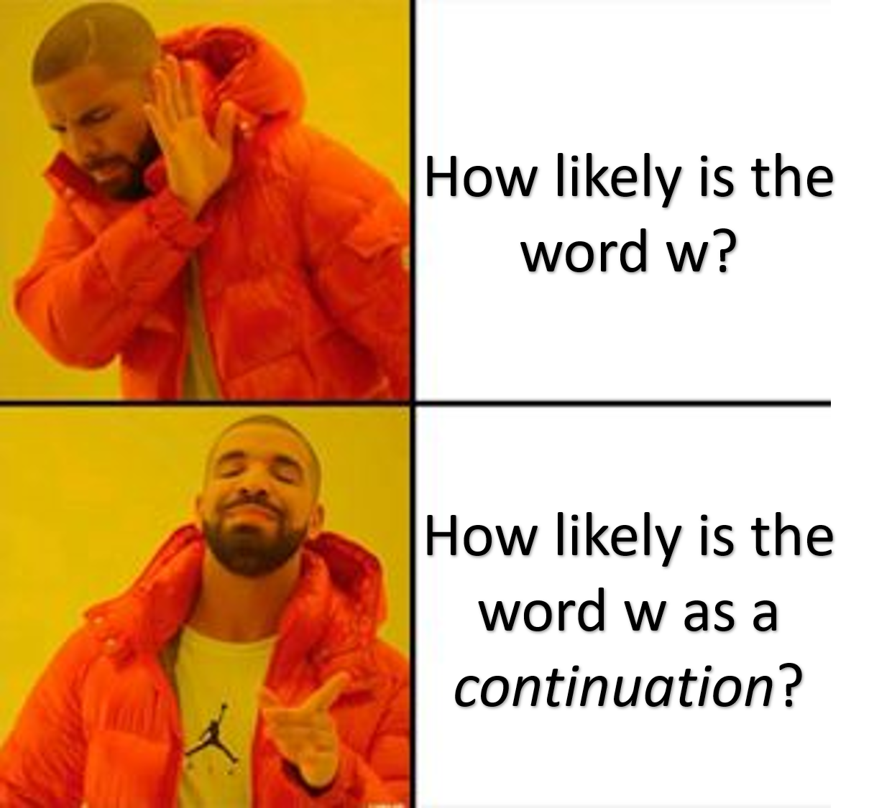

---
title:
- Assignment 5,6 + Smoothing 2
subtitle: |
    | (SNLP Tutorial 6)
author:
- Vilém Zouhar, Awantee Deshpande, Julius Steuer
theme:
- Boadilla
date: 1st, 2nd June 2021
aspectratio: 169
header-includes:
  - \AtBeginDocument{\usepackage{graphicx}}

documentclass: beamer
---

# Assignment 5

- Exercise 1: OOV Words
- Exercise 2: Additive smoothing
- Exercise 3: Perplexity, infinite smoothing, interpolation
- Bonus: Other language models

# Cross-validation
- K-fold cross-validation: Divide data into k subsets, train on k-1 subsets and test on the remaining 1. 
- Leave One Out cross-validation: Train on all data points except one. Do this N times.

::: frame
## Questions
- Why is cross-validation beneficial?
- How does shuffling the dataset affect the LOOV score?
- When is k-fold cross-validation beneficial over standard cross-validation?
::: 
<!-- CV prevents overfitting, used in hyperparameter estimation --->

# Smoothing Techniques - Basics

- We perform smoothing to keep a language model from assigning 0 or ~0 probabilities to rare/unseen events
- Generally we can smooth any arbitrary distribution
- Different ways to do this...

# Floor Discounting

\center
$$ P(w|h) = \frac{N(w,h) + \epsilon}{N(h) + \epsilon \cdot V}$$

Variants: Laplace smoothing, Lidstone smoothing, add-$\alpha$ smoothing...

<!-- Where is Laplace smoothing useful? Text classification, where zero counts are relatively fewer... -->

# Good-Turing

Data: {width=15px}
{width=15px}
{width=15px}
{width=15px}
{width=15px}
{width=15px}
{width=15px}
{width=15px}
{width=15px}
{width=15px}
{width=15px}
{width=15px}
{width=15px}
{width=15px}
{width=15px}
{width=15px}

. . .

::: columns
:::: column
- $N_4$ = \{{width=15px}\}
- $N_3$ = \{{width=15px}, {width=15px}\}
- $N_2$ = \{{width=15px}\}
- $N_1$ = \{{width=15px}, {width=15px}\}
- $N_0$ = \{{width=15px}\}
::::

. . .

:::: column
$$p_r = \frac{(r+1)N_{r+1}}{N_r} \cdot \frac{1}{N}$$
::::
:::

. . .

- Nominator: expected total number of occurences of words that occur $r+1$ times
- Denominator-left: previous bucket size
- Fraction-left: expected number of occurences of a single word from that bucket
- Denominator-right: divide by total occurences

# Good-Turing - Questions

> - Let $k$ be the maximum occurence of a word. What's the issue? <!-- The next bucket is empty. -->
> - A similar issue related to the one above? <!-- High frequency becomes sparse, neighbouring buckets are empty -->
> - Do the probabilities sum up to $1$? <!-- Yes, do sum from 1 to max-k and multiply each prob by N_k -->
> - How to make it work for anything above unigrams? <!-- Works for any freq distribution -->

# Linear Intepolation/Jelinek-Mercer Smoothing

\centering
$B_1$: (FROZEN YOGHURT)

$B_2$: (FROZEN RED)

What will floor discounting do here? Can we interpolate our bigram model with a unigram model?

$$P(w|h) = \lambda_1 P(w|h) + (1 - \lambda_1) P(w)$$
Can be generalised to higher order n-grams.

::: frame
## Questions
- What condition must be fulfilled for higher n-grams?
- How is $\lambda_i$ determined? <!-- Held out data / Use frequencies of history (similar to discounting) -->
- Can you smooth the above probabilities?
::: 

<!-- lambda determined using EM/Baum-Welch Algorithm -->
<!-- Can also interpolate multiple LMs as in Assignment 5 -->

# Backing-Off models

- What other way can we use the lower-order n-gram distributions? Is a lot of context always a good thing?
- Idea behind back-off models: Use information from a lower order n-gram distribution.
<!-- - A "recursion" strategy... -->

\begin{equation}
{
  P(w|h) = 
  \begin{cases}
  \frac{N(w,h)-d}{N(h)} + \alpha(h)\beta(w|h) & \text{for N(w,h) > 0}\\
  \alpha(h)\beta(w|h) & \text{otherwise}
  \end{cases}
}
\end{equation}

# Absolute Discounting
<!-- Uses the best of Good Turing and interpolation -->

::: frame
## Corpus
* Train set: 

\qquad {width=12px}
{width=12px}
{width=12px}
{width=12px}
{width=12px}
{width=12px}
{width=12px}
{width=12px}
{width=12px}
{width=12px}
{width=12px}
{width=12px}
{width=12px}
{width=12px}
{width=12px}
{width=12px}

* Test set:

\qquad {width=12px}
{width=12px}
{width=12px}
{width=12px}
{width=12px}
{width=12px}
{width=12px}
{width=12px}
{width=12px}
{width=12px}
{width=12px}
{width=12px}

:::

. . .

:::frame
## Distribution
* Vocabulary counts

{width=12px} `6` \qquad
{width=12px} `5`  \qquad
{width=12px} `3` \qquad
{width=12px} `2` \qquad
{width=12px} `0` \qquad
{width=12px} `0` \qquad

* Decrease all non-zero counts by some parameter d = 0.75

<!-- Church and Gale’s clever idea was to look at a held-out corpus and just see what the count is for all those bigrams that had count
n in the training set. They observed that except for the held-out counts for 0 and 1, all the other bigram counts in the held-out set could be estimated pretty well by just subtracting some value d from the count in the training set! -->

{width=12px} `6-0.75` \qquad
{width=12px} `5-0.75`  \qquad
{width=12px} `3-0.75` \qquad
{width=12px} `2-0.75` \qquad
{width=12px} `0` \qquad
{width=12px} `0` \qquad

* Divide by $N = 16$

{width=12px} `0.33` \qquad
{width=12px} `0.26`  \qquad
{width=12px} `0.14` \qquad
{width=12px} `0.11` \qquad
{width=12px} `0` \qquad
{width=12px} `0` \qquad
:::

. . .

Sum = 0.33+0.26+0.14+0.11 = 0.84 $\ne$ 1.

. . .

Idea: Utilise this probability mass for zero counts.

# Absolute Discounting

$$P(w|h) = \frac{c(w,h) - d}{c(h)}$$

Adjust the probability mass $1 - \sum_{h} \frac{c(w,h) - d}{c(h)}$

<!--The intuition is that since we have good estimates already for the very high counts, a small discount d won’t affect them much-->
. . .

e.g. For bigrams,

$$P_{abs}(w_i|w_{i-1}) = \frac{max\{N(w_{i-1}, w_i)-d, 0\}}{\sum_{w'}N(w_{i-1}, w')} + \lambda(w_{i-1})P_{abs}(w_i)$$
$$P_{abs}(w_i) = \frac{max\{N(w_i)-d, 0\}}{\sum_{w'}N(w')} + \lambda(.)P_{unif}(w_i)$$
$$\texttt{where } \lambda(w_{i-1}) = \frac{d}{\sum_{w'}N(w_{i-1},w')} \cdot N_{1+}(w_{i-1}, \bullet)$$
$$\lambda(.) = \frac{d}{\sum_{w'}N(w')} \cdot N_{1+}$$

<!--If S seen word types occur after wi-2 wi-1 in the training data, this reserves the probability mass P(U) = (S ×D)/C(wi-2wi-1) to be computed according to P(wi | wi–1).-->

# Absolute Discounting - Questions

- How does the discounting parameter *d* affect perplexity?
- What values can *d* take? Why?
- What if we set *d* to $\infty$?
- What problems does Absolute Discounting have?

# Kneser-Ney Smoothing

Idea: Can we use the lower order distributions in a better way?

\centering
I WENT TO THE GROCERY _________ .

Options:

$W_1$: STORE

$W_2$: YORK

. . .

Use the fact that YORK generally appears as context or \textit{continuation} of the word NEW. 

# Kneser-Ney Smoothing

\centering
{width=300px}

<!--e our estimate of PCONTINUATION on the number of different contexts word w has appeared in, that is, the number of
bigram types it completes-->

# Kneser-Ney Smoothing

$$P_{continuation}(w) \propto |\{w': C(w',w) > 0\}| $$

$$\texttt{**Don't forget to normalise!**}$$

$$P_{KN}(w_i|w_{i-n+1:i-1}) = \frac{max\{C_{KN}(w_{i-n+1:i-1}, w_i)-d,0\}}{\sum_{w'}C_{KN}(w_{i-n+1:i-1}w')} + \lambda(w_{i-1})P_{continuation}(w_i)$$

\begin{equation}
{ \text{where}
  C_{KN}(\bullet) = 
  \begin{cases}
  count(\bullet) & \text{for highest order} \\
  continuationcount(\bullet) & \text{for lower orders}
  \end{cases}
}
\end{equation}

Will be covered in detail in the next tutorial...

# Pruning

- Back-off models and interpolation save n-grams of all orders.

We are storing all $V^n + V^{n-1} + ... + V + 1$ distributions!

. . . 

- Idea: Store the counts which exceed a threshold $c(\bullet) > K$. Also called a "cut-off".
- Idea: Use some information-theory based approach to determine the nature of the probabilities, and then prune the lower orders. Known as *Stolcke Pruning*.

. . .

::: frame
## Questions
- Does pruning assign 0 probability to the pruned n-grams?
- Can we prune an entire branch/subtree? What does this mean? <!-- pruning at distribution level -->
<!-- f pb = p(w|vb) and pab = p(w|va, vb), then prune the pab branch if D(pab||pb) < epsilon. 
p(w1, . . . , wT ) = p(w1)p(w2|w1)p(w3)p(w4|w2, w3)p(w5|w2, w3, w4)· · · p(wT |wT−1) -->
- What is a good pruning strategy?
<!-- Grow the entire tree and then prune. Don't do ad hoc pruning. -->
::: 

# Assignment 6

- Exercise 1: MAP and MLE estimates
- Exercise 2: Good Turing Smoothing
- Exercise 3: Cross-Validation

# Resources

1. UdS SNLP Class: <https://teaching.lsv.uni-saarland.de/snlp/>
2. n-gram models: <https://web.stanford.edu/~jurafsky/slp3/3.pdf>
3. Entropy pruning: <https://arxiv.org/pdf/cs/0006025.pdf>
4. Twitter emojis