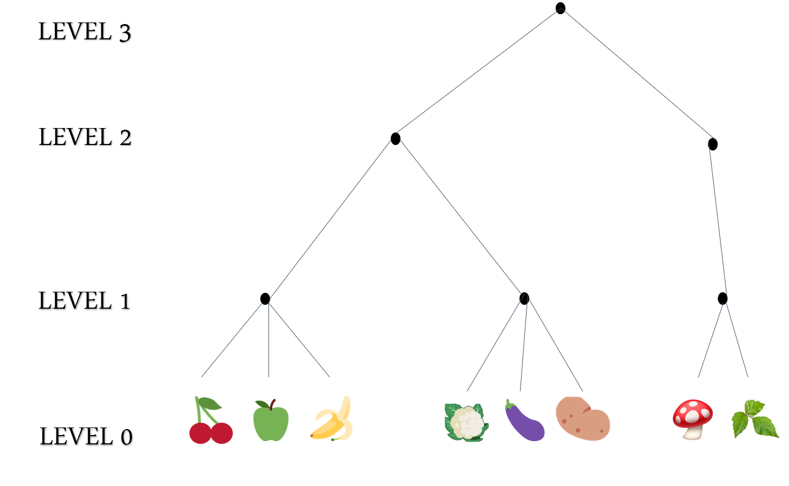
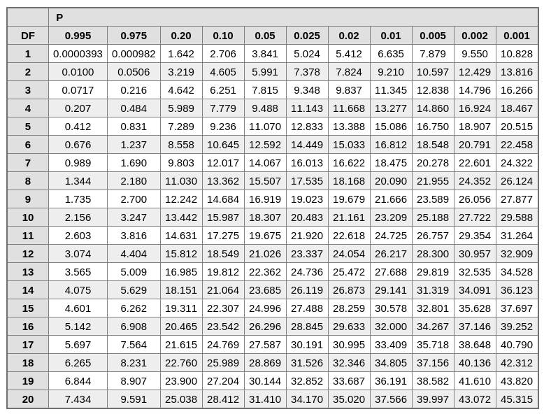

---
title:
- Assignment 7, 8 + Text Classification Basics
subtitle: |
    | (SNLP Tutorial 8)
author:
- Vilém Zouhar, Awantee Deshpande, Julius Steuer
theme:
- Boadilla
date: 15th, 17th June
aspectratio: 169
header-includes:
  - \AtBeginDocument{\usepackage{graphicx}}

documentclass: beamer
# classoption: notes
---

# Assignment 7

- Exercise 1: Count Tree
- Exercise 2: Kneser-Ney Smoothing
- Bonus: Smoothing Techniques

# Text Classification

Fill in the classes:

> - $f: \text{Text} \rightarrow C$ (classes/categories)
> - Topic detection: $\text{Document} \rightarrow$
> - $\qquad \{\text{politics}, \text{NLP}, \text{healthcare}, \text{sport}, \ldots\}$
> - Spam detection: $\text{Document}\rightarrow$
> - $\qquad \{\text{SPAM}, \text{BENIGN}, \text{MARKETING}\}$
> - Author identification/profiling: $\text{Document(s)}\rightarrow$
> - $\qquad \{\text{F. Bacon}, \text{W. Shakespeare}, \ldots\}$
> - Native language identification: $\text{Document}\rightarrow$
> - $\qquad \{\text{German}, \text{Polish}, \ldots\}$
> - POS Tagging: $\text{Sentence}\rightarrow$
> - $\qquad \{NN, VERB, PART., \ldots\}^{|S|}$
> - Sense Disambiguation: $\text{Word+sentence}\rightarrow$
> - $\qquad \text{Senses of Word}$

Issues with this?
<!-- No structure preserved, not practical -->

# Classification vs. Clustering

||Classification|Clustering|
|-|-|-|
|Method|???|???|
|Classes|???|???|
|# Classes|???|???|

. . .

||Classification|Clustering|
|-|-|-|
|Method|Supervised|Unsupervised|
|Classes|Given|Unknown|
|# Classes|Given|(Mostly) unknown|

# Binary vs. Multi-Class Classification

## Multi-Class
- $f: D \rightarrow \{\text{politics}, \text{NLP}, \text{healthcare}, \text{sport}, \ldots\}$

How to turn this into a binary classification?

. . .

## Binary
- $f_1: D \rightarrow \{\text{politics}, \text{not politics}\}$
- $f_2: D \rightarrow \{\text{NLP}, \text{not NLP}\}$
- $f_3: D \rightarrow \{\text{healthcare}, \text{not healthcare}\}$
- ...

. . .

How to turn multiple {multi-class|binary} into a single multi-class?  

# Flat vs. Hiearchical

## Flat Classification
$f_1: D \rightarrow$ 
{width=20px}
{width=20px}
{width=20px}
{width=20px}
{width=20px}
{width=20px}
{width=20px}
{width=20px}

. . . 

## Hierarchical Classification
\centering

{width=240px}

What is this structure similar to in classification?

<!--{fruits, vegetables, misc}, {edible, inedible}-->

<!-- # Single-Category vs Multi-Category

> - Topic detection: $\text{Document} \rightarrow \{\text{politics}, \text{NLP}, \text{healthcare}, \text{sport}, \ldots\}$
> - Sentiment analysis: $\text{Document} \rightarrow \{\text{positive}, \text{negative}, \text{interested}, \ldots\}$

> - Topic detection: $\text{Document} \rightarrow {\{\text{(politics, news)}, \text{(NLP, Machine Learning)}, \text{(healthcare, nutrition)}, \text{(sport, biography)}, \ldots\}}$
> - Sentiment analysis: $\text{Document} \rightarrow {\{\text{(positive, happy)}, \text{(negative, sad)}, \text{(neutral, ambivalent)}, \ldots\}}$ -->

# Feature Extraction

- Move from text to more processable domain
- How? (at least three "approaches")

. . .

## Binary/indicator features

$f_b(doc) = \begin{cases} 1 \qquad \text{Contains string } \texttt{"Super free \$\$\$ discount"} \\ 0 \qquad \text{Otherwise} \end{cases}$

. . .

## Integer features

$f_i(doc) = \text{Number of occurences of } \texttt{"buy"}$

. . .

## Real-valued features

$f_r(doc) = \frac{\text{Number of occurences of } \texttt{"buy"}}{|doc|}$

. . .

##
Name a scenario where you can use each of these...

<!-- Binary: IR (retrieve doc if term is present)
    Integer: Author classification (Good indicator if it occurs > k times) 
    Real values: Scaling, normalisation, weighting terms, comparison purposes -->

# Document Frequency

\begin{block}{DF}
$$df(term) = \frac{|\{doc| term \in doc, doc \in D\}|}{|D|}$$ 
\end{block}

- Remove rare items ($df \le \frac{2}{|D|}$) \newline
  Won't occur in new documents anyway
- Remove frequent items ($df = 1$) \newline
  Usually stop words \newline
  No information

  <!--scales easily to very large corpora with an approximately linear computational complexity in the number of training documents
  when a term belong to more than one class ,the evaluate function will make high score to it; however, if the term belong to a single category, lower frequency of occurrence lead to a lower score. DF evaluation function theory based on a hypothesis that rare term does not contain useful information (hence used with IDF to balance this).-->

. . .

- Why not always a good idea?
- How is this feature used in retrieval?

<!-- - Stopword distribution gives information in author identification
- Sometimes not a good idea (interaction with other terms, etc.) -->
<!-- Inverse document frequency TIMES term frequency -->

# Term Frequency - Inverse Document Frequency

\begin{block}{TF-IDF}
$$tf(term, doc) = \frac{count_{doc}(term)}{|doc|}$$
$$df(term) = \frac{|\{doc| term \in doc, doc \in D\}|}{|D|}$$ 
$$idf'(term) = \frac{|D|}{df(term)}, idf(term) = \log_2\bigg(\frac{|D|}{df(term)}\bigg)$$
$$tf-idf(term, doc) = tf(term, doc) \times idf(term)$$
\end{block}

- How can we use tf-idf for document similarity?

# Information Gain

- Information gained (reduction in entropy) by knowing whether a term is present

## Information Gain

\begin{align*}
G(C,t) =& H(C) - H(C|t) \\
=& - \sum_i p(c_i) \log p(c_i) \\
&+\ p(t) \sum_i p(c_i|t) \log p(c_i|t) \\
&+\ p(\overline{t}) \sum_i p(c_i|\overline{t}) \log p(c_i | \overline{t})
\end{align*}

## Questions
- When is Information Gain 0? When is it positive? Can it be negative?
- Term t occurs in all classes equally. Is it a good feature?

<!--terms whose information gain is less than some predetermined threshold are removed from the feature space-->

# Pointwise Mutual Information

- Difference between observed distribution and independent

## PMI

\begin{align*}
\text{pmi}(c_i, t) = \log \frac{p(c_i, t)}{p(c_i)\cdot p(t)}
\end{align*}

## Another formulation

$$PMI(t,c) = \log \frac{A \cdot D}{(A+C)\cdot (A+B)}$$

where 

A = co-occurrence of c and t

B = #times t occurs without c

C = #times c occurs without t

D = #documents in c

# Pointwise Mutual Information

## Relation to Mutual Information

MI = weighted pmi = expectation of pmi over all events

## Questions
<!-- - How is pmi(c,t) used at a global scale? -->
 <!-- By PMI avg or PMI max and thresholding -->
- When is PMI 0? 

  When is it positive? 

  Can it be negative? 
<!-- if there is genuine association between t and c, PMI > 0.
If t and c are statistically independent, PMI = 0
If t and c have complementary distributions, PMI < 0 -->

# Chi Square $\chi^2$

\begin{equation}
\chi^2_n (c_1, c_2) = \sum_{j} \frac{(O_j-E_j)^2}{E_j}
\end{equation}

- $n$ : Degrees of freedom
- $O_j$: Observed absolute frequency of the feature $j$
- $E_j$: Estimated absolute frequency of the feature $j$
- $E_j = p_{j} \cdot N$
- $N$: Number of observations in one class

> - Null Hypothesis: ?
> - The two events are independent.

# $\chi^2$ Example

\begin{equation}
\chi^2 (c_1, c_2) = \sum_{j=1}^{m} \frac{(O_j-E_j)^2}{E_j}
\end{equation}

Imagine a language with the following syllable structure: $CV$, $C \in \{p,k\}$, $V \in \{a,u\}$:

|C/V|k   |p   |    |
|-- |--  |--  |--  |
|a  |75  |33  |108 |
|u  |31  |61  |92  | 
|   |106 |94  |200 |

> - What is expected number of occurences of `ka`?
> - $p_{a} = \frac{108}{200} = 0.54$, $N_k = 75+31 = 106$
> - $E_{ka} = p_{a} \cdot N_k = 0.54 \cdot 106 = 57.24$
> - $\frac{(O_{ka}-E_{ka})^2}{E_{ka}} = \frac{(75-57.24)^2}{57.24} \approx 5.51$

# $\chi^2$ Example, continued

\begin{equation}
\chi^2 (c_1, c_2) = \sum_{j=1}^{m} \frac{(O_j-E_j)^2}{E_j}
\end{equation}

- And so forth for all other cells

|C/V|k   |p   | 
|-- |--  |--  |
|a  |5.51  | $pa$ |
|u  |$ku$  | $pu$ |

# $\chi^2$ Example, continued

- And so forth for all other cells:

|C/V|k   |p   | 
|-- |--  |--  |
|a  |5.51  | 6.21 |
|u  |6.47  | 7.29 |

> - $\chi^2 = 5.51+6.21+6.47+7.29 = 25.48$
> - Degrees of freedom: $df = (\#_{rows}-1) \cdot (\#_{cols}-1) = (2-1) \cdot (2-1) = 1$ 
> - Choose significance level $\alpha$
> - What are common significance levels?
> - Look up $\chi^2$-value in a $\chi^2$-table
> - Reject $H_0$ if $\chi^2 > \chi^2_{(\alpha,df)}$

# $\chi^2$ Table Lookup
- Calculated $\chi^2 = 25.48$
- $df = 1$
- $\alpha = 0.05 \rightarrow \chi^2 = 3.84$
\center
{width=300px}

# Term Strength

- Two documents: $d_1, d_2$
- Term $t$
- $p(t \in d_2 | t\in d1)$
- _What is the probability that the term $t$ will be in $d_2$ given that it is in $d_1$?_
- If two documents related $\rightarrow$ high probability
- If two documents not related $\rightarrow$ low probability

## Questions
Can we use term strength for

- Stopword removal <!--stopwords will be discovered automatically, uniform distributio nacross documents-->
- Document Clustering <!--Use cosine similarity to find related documents, all pairs with cosine > threshold are related -->

# Resources

1. UdS SNLP Class: <https://teaching.lsv.uni-saarland.de/snlp/>
2. Information Gain in decision trees: <https://en.wikipedia.org/wiki/Information_gain_in_decision_trees#Example>
3. PMI in classification: <https://towardsdatascience.com/multinomial-na%C3%AFve-bayes-classifier-using-pointwise-mutual-information-9ade011fcbd0>
4. $\chi^2$ table: <https://www.medcalc.org/manual/chi-square-table.php>
5. $\chi^2$ example: <https://towardsdatascience.com/chi-square-test-for-feature-selection-in-machine-learning-206b1f0b8223>
6. Term Strength: <http://mlwiki.org/index.php/Term_Strength>
7. Comparison of Feature Selection Techniques: <https://citeseerx.ist.psu.edu/viewdoc/download?doi=10.1.1.32.9956&rep=rep1&type=pdf>