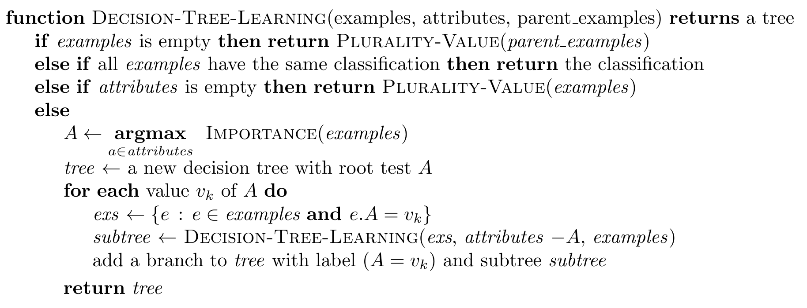
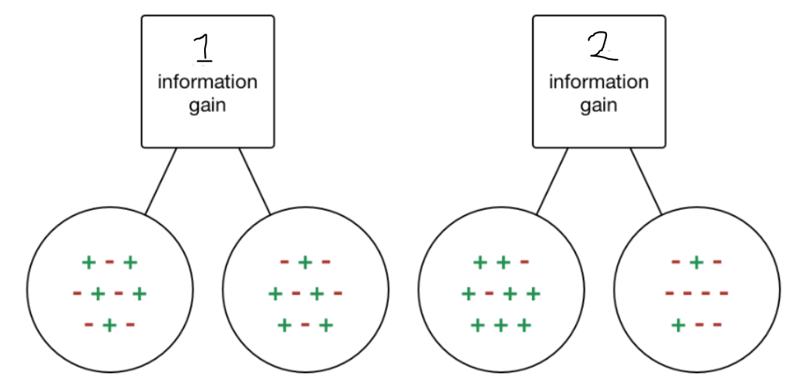
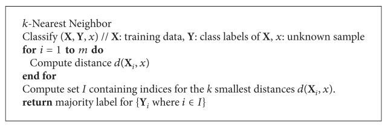

---
title:
- Assignment 8,9 + Classifiers
subtitle: |
    | (SNLP Tutorial 9)
author:
- Vilém Zouhar, Awantee Deshpande, Julius Steuer
theme:
- Boadilla
date: 22nd, 24th June
aspectratio: 169
header-includes:
  - \AtBeginDocument{\usepackage{graphicx}}

documentclass: beamer
# classoption: notes
---

# Assignment 8

- Exercise 1: Feature Selection (DF, PMI)
- Exercise 2: $\chi^2$
- Exercise 3: Author identification
- Bonus: Features for clustering

# Decision Trees

- Can be used for classification as well as regression
- Algorithm

{width=450px}

##
What is plurality value? <!--most common value in examples-->

What is importance? <!--any metric like IG, Chi Square etc.-->

# Decision Trees - Questions
- Which of the 2 splits has a better information gain?

\center
{width=300px}

. . . 

\raggedright
- What are the pros and cons of decision trees?
<!--
Advantages: Less data preparation, no data scaling, missing values are okay
Disadvantages: Prone to overfitting, very sensitive to data rotation (not robust to change in data), high calculation and training time.
-->

. . .

- How to avoid overfitting? <!--Pruning, random forest-->

# Naïve Bayes

TODO

# kNN
- Algorithm

{width=350px}
\tiny Source:https://www.researchgate.net/figure/Pseudocode-for-KNN-classification_fig7_260397165

\normalsize
## Questions
- What are the training and test computation times for kNN?
- What are the pros and cons of kNN classifiers?
<!--
Advantages: No training, robust to new data
Disadvantages: Scales poorly with large data or more dimensions, needs feature scaling, sensitive to outliers
-->
- Can kNN be used for regression? <!--yes, use average/max or similar metric-->
- How will the value of k affect the bias? <!--Large k = simpler model = high bias-->

# SVM

- Find a boundary that maximizes the distance to closest vectors
- If not possible, find one that minimizes the error
- Add the kernel trick

# Perceptron

- Binary classification
- Linear boundary in feature space
- $\hat{y} = \text{sign}(wx+b)$

. . .

Algorithm:

- $w_0 = \overrightarrow{0}$
- For every data point $x_i$
- - $\hat{y_i} = \text{sign}(w_k x_i +b)$
- - if $\hat{y_i} \ne y_i$:
- - - $w_{k+1} = w_k - \hat{y_i} \cdot x$
- - else:
- - - $w_{k+1} = w_k$

. . .

- TODO: illustration
- TODO: advantages/disadvantages

# Useful Python Implementations

# Resources

1. UdS SNLP Class, WSD: <https://teaching.lsv.uni-saarland.de/snlp/>
2. Decision Trees: <https://www.kdnuggets.com/2020/01/decision-tree-algorithm-explained.html>
3. kNN Example: <https://iq.opengenus.org/text-classification-using-k-nearest-neighbors/>